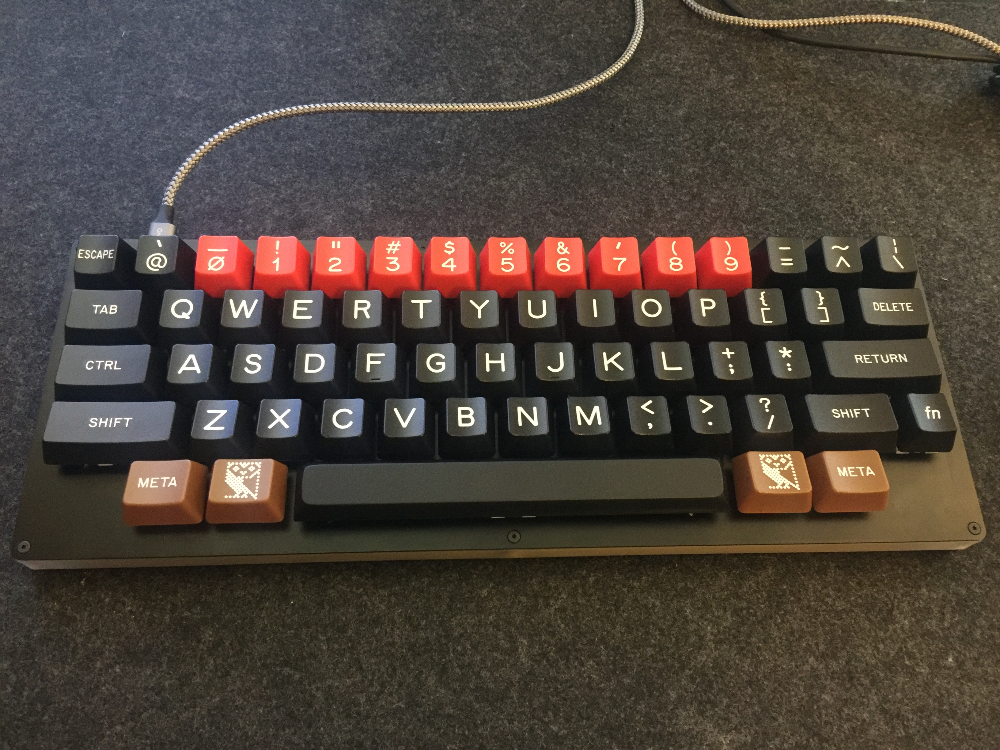
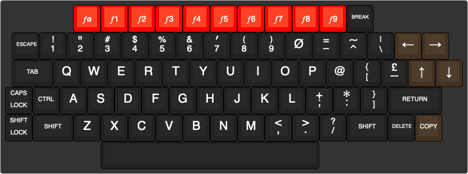
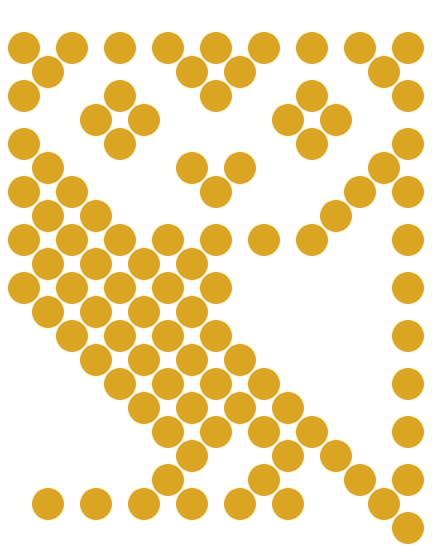

A keyboard like the BBC Micro, made from modern parts
=====================================================

It's the 40th anniversary of the BBC Micro later this year. I am
trying to make a keyboard in a similar style, made from modern parts.

The Beeb's keyboard was what is now called a mechanical keyboard.
There's a very lively community of mechanical keyboard makers and
customizers, who have made it fairly easy to get a long way with
off-the-shelf parts.

If you would like to make a similar keyboard, please feel free to use
this work as you wish - see the [LICENSE](LICENSE.md) for details.

Contents
--------

  * [The BBC Micro keyboard](#the-bbc-micro-keyboard)
  * [Modern keyboard sizes](#modern-keyboard-sizes)
  * [Adjusting the BBC Micro layout](#adjusting-the-bbc-micro-layout)
      * [ANSI vs ECMA](#ansi-vs-ecma)
  * [Keycaps](#keycaps)
      * [keycap profile](#keycap-profile)
  * [Owl logo](#owl-logo)
  * [WASD keyboard layout](#wasd-keyboard-layout)
  * [Gorton-like fonts](#gorton-like-fonts)
      * [typographical notes on legends](#typographical-notes-on-legends)
      * [legend sizes](#legend-sizes)
  * [Sandwich case](#sandwich-case)
      * [Surround](#surround)
      * [Layers](#layers)
      * [Plate](#plate)
      * [PCB and components](#pcb-and-components)
      * [Fasteners](#fasteners)
      * [Illumination](#illumination)

The BBC Micro keyboard
----------------------

The Beeb's keyboard was mostly a standard [ECMA-23][] layout. The main
oddity from today's point of view is that it has a [bit-paired][]
punctuation layout.

In addition to the basic ECMA-23 keys (all black) the Beeb has some
colourful extras: red function keys and greenish brown arrow keys.

[ECMA-23]: https://en.wikipedia.org/wiki/ECMA-23
[bit-paired]: https://en.wikipedia.org/wiki/Bit-paired_keyboard

I have drawn the [BBC Model B][] and [BBC Master][] keyboard using the
online [Keyboard Layout Editor][KLE] (KLE). The Model B has 74 keys,
and the Master has 93 keys.

[KLE]: http://www.keyboard-layout-editor.com/

Modern keyboard sizes
---------------------

Key sizes are usually quoted as so many "u", as in units, which are
the size of one standard key. 1u is 0.75 inches (19.05 mm).

There are a number of common form-factors, including:

  * Tenkeyless, aka TKL: Like a full-size keyboard without the number
    pad (which has more than 10 keys, shrug)

  * 60%: Just the main block of the keyboard; no function keys or
    arrow keys etc. The overall size is 15u x 5u, typically with 61
    keys.

  * 75%: Like a TKL but with the function and arrow keys smooshed
    together, so there's a single block of keys. The overall size is
    16u x 6u, typically with 84 keys.

The more we re-use one of these standard layouts, the easier it will
be to build (e.g. using off-the-shelf cases and PCBs) at the cost of
authenticity.

Adjusting the BBC Micro layout
------------------------------

The Model B keyboard is slightly wider than a 75% board: CAPS LOCK and
SHIFT LOCK stick out 0.25u on the left, and DOWN sticks out 0.5u on
the right. It can be made to fit in a 75% case by using a BBC Master
arrow cluster, and by displacing the LOCK keys. To be usable with a
modern operating system, the keyboard also needs a few more modifier
keys.

My [BBC Master 75%][] layout is based on those ideas. However, fitting
in the 75% form factor isn't as useful as it might be: in typical 75%
case designs, there are PCB mounting holes mid-way between some of the
function keys, which are aligned with the number row below; but the
Beeb's function keys are offset by 0.5u so they clash with the
mounting holes.

A standard 75% ISO board could be given a Beebish appearance with just
some replacement keycaps, like my [Beeb 75% ISO][] layout.

I like small keyboards, so I have made a [Beeb 60% HHKB][] layout.
This has a slightly jokey number row is shifted towards the centre. My
original design had the number keys in 0-9 order, like the BBC Micro
function keys, but the conventional order turned out to be less
troublesome.

I have labelled the modifier keys in [Space Cadet][] style: meta is
sometimes an alias for alt; [super is a common legend][super] for what
the [USB HID][] spec calls the GUI key; and hyper is for programmable
keymap layers.

[BBC Model B]: http://www.keyboard-layout-editor.com/#/gists/f89a6054d6d76e3fe4a5aa9e5e0e5bec
[BBC Master]: http://www.keyboard-layout-editor.com/#/gists/16e4909fcb8b0c31d4b6a63912db6c3b
[BBC Master 75%]: http://www.keyboard-layout-editor.com/#/gists/71a93d79bc55dbffa7b49be7e8e1d381
[Beeb 75% ISO]: http://www.keyboard-layout-editor.com/#/gists/6a842768ef36cce78c7f452732fe69bf
[Beeb 60% HHKB]: http://www.keyboard-layout-editor.com/#/gists/6791130c7705b4a48605ad0ebdb61e1f
[Space Cadet]: https://en.wikipedia.org/wiki/Space-cadet_keyboard
[super]: https://pimpmykeyboard.com/dsa-black-white-keyset-two-shot/
[USB HID]: https://wiki.osdev.org/USB_Human_Interface_Devices

### ANSI vs ECMA

Unlike AT-101 scan codes, the [USB HID usage table][] for keyboards is
in a layout-independent order (for instance, the letters are
alphabetical), though footnote 2 on USB HID usage page `0x07` says
that language-dependent remapping is handled by the OS (for example,
numbers are shifted on French keyboards, and punctuation is
unshifted). So in practice a USB keycode still corresponds to a key in
a particular position in a conventional keyboard layout.

These keys needed remapping in the OS, with [Ukelele][]:

  * `;+` / `;:`
  * `:*` / `′"`
  * `=-` / `-_`
  * `^~` / `=+`
  * `@‵` / `‵~`

  * `2"` / `2@`
  * `6&` / `6^`
  * `7′` / `7&`
  * `8(` / `8*`
  * `9)` / `9(`
  * `0_` / `0)`

The centred red number keys are remapped in the keyboard firmware with
[VIA][]. This makes the keyboard easier to use when plugged into a
system without further configuration, since most of the keys match the
keycodes suggested by their keycaps.

A disadvantage of remapping using the keyboard firmware is that
software keyboard views in [Ukelele][] and the macOS Keyboard Viewer
do not match the hardware so well. For my layout the main consequence
is that the top row is shifted right one key to make room for ESCAPE,
a small difference that is easy to cope with. (This is one of the
reasons for not keeping the jokey 0-9 number key order.)

[Karabiner Elements]: https://karabiner-elements.pqrs.org/
[Ukelele]: https://software.sil.org/ukelele/
[USB HID usage table]: https://www.usb.org/hid
[VIA]: https://caniusevia.com/

### Configuration details

Mac OS controls: change ⌘` to ⌘@ in System Preferences.

On the keybow, configured with CircuitPy:

   * row 0: F13 - F16
   * row 1: F17 - F20
   * row 2+3: arrows + navigation

Actions on the Keybow configured elsewhere:

  * F13 - F16: mission control / spaces (System Preferences)
  * F17 - F20: tiled window movement (Hammerspoon)
  * alt + F13 - F20: tiled window movement (Hammerspoon)

By default in macOS, modifier keys on one keyboard (e.g. the HS60) do
not affect key presses on another keyboard (e.g. the Keybow). To fix
this, install [Karabiner Elements][]. I don't actually need Karabiner for
anything else...

Keycaps
-------

Most current keyboard layouts are not ECMA-23 (the main exceptions are
Japanese keyboards), so as well as remapping in software, a Beebish
keyboard needs several custom keycaps. This is difficult. The
manufacturing options are, basically:

  * double-shot injection moulding, which would need custom metal
    legends to be fabricated;

  * dye sublimation printing, which is a skilled manual process (so
	one-off keycaps can cost $5 each), and cannot normally do
	white-on-black;

  * pad printing; laser etching; neither of which appear to be a
    popular option for custom keysets;

  * UV cured, used by print-on-demand suppliers.

Double-shot and dye-sub sets give you a lot of choice in [keycap
profile][] and type of plastic, but have a large minimum order
quantity. Custom set manufacturing is usually organized with a "group
buy" process, like a DIY kickstarter.

Custom UV printed keyboards are available from [Max Keyboard][] and
[WASD Keyboards][]; both of them will only print on to ABS plastic
with the OEM profile.

### keycap profile

The BBC Micro keycap profile is uniform (all rows the same, not
sculptured like the [OEM profile][]) with shallow spherical keytops
(not cylindrical like OEM), and all keytops angled backwards (not flat
like the [DSA profile][SP families]) to produce a stairstep effect
when the whole board is angled forwards.

It was probably the [Comptec / Signature Plastics][SP origins] old SA
profile, before SA was changed from uniform to sculptured. A modern
version might be to use [SA or DSS][SP families] (both are spherical
and sculptured) but made into a uniform set by manufacturing all keys
with a shape from the same row.

[beeb keycap closeups]: https://geekhack.org/index.php?topic=28630.0
[keycap profile]: https://old.reddit.com/r/MechanicalKeyboards/comments/j484j5/keycap_profiles_i_compiled_a_direct_comparison/
[Max Keyboard]: https://www.maxkeyboard.com/shop/cherry-mx-keycaps/custom-color-printed-keycaps/
[OEM profile]: https://support.wasdkeyboards.com/hc/en-us/articles/115009701328-Keycap-Size-Compatibility
[SP families]: https://pimpmykeyboard.com/key-cap-family-specs/
[SP origins]: https://pimpmykeyboard.zendesk.com/hc/en-us/articles/204415935-The-Origin-of-SP-Keycap-Families
[WASD Keyboards]: https://www.wasdkeyboards.com/products/keycaps/keycap-set.html

Owl logo
--------

The BBC Micro was part of the BBC's computer literacy project, whose
logo was a dot-matrix owl. I have previously made my own version of
[the BBC owl in SVG](http://dotat.at/random/bbc-owl.html), which I am
going to re-use as an [owl keycap legend](owl/bbc-owl.svg). I have
removed the blobby effect from the keycap version, because printing
will take care of that for me.

The owl will appear on the GUI / OS / Win / command keys, so it will
be a super beeb owl.

WASD keyboard layout
--------------------

I have turned [my KLE HHKB design][Beeb 60% HHKB] into a layout for
submission to WASD for manufacturing. The [beeb.svg](wasd/beeb.svg)
file has the keycap legends as text for editing; the
[paths.svg](wasd/paths.svg) file has legends as paths for printing.

This layout has the number row in a more common order, to reduce the
risk of misunderstandings by the WASD staff. I edited the [WASD
template][] so that it has a split backspace and split right shift, to
match the HHKB layout, and I made the background black for better
contrast with the white legends.

[WASD template]: https://support.wasdkeyboards.com/hc/en-us/articles/115007847008-Download-Template-Files

The modifiers on the bottom row do not match the HHKB exactly. The
original HHKB has a 6u spacebar with two modifiers either side. I have
an [HS60 HHKB PCB][HS60] which has a [Tsangan][] bottom row: a 7u
spacebar with three modifiers (1.5u, 1u, 1.5u) each side; WASD do not
have a 7u spacebar or 1.5u row 1 modifiers.

I'm going to get a 7u spacebar elsewhere; the 3 x 1.25u modifier keys
from WASD will fit the Tsangan layout, except for a 0.125u gap on each
side (i.e. 1/8 * 3/4 inch or 2.4mm) which I think is tolerable.

I would probably prefer ctrl/delete/return/shift/tab to be brown, but
WASD do not have brown 1.75u shift keys, so it's better to leave them
all black.

Colour matching is somewhat problematic. WASD brown (#6F4C23) is the
closest to the BBC Micro arrow keys (RAL 8014, #4A3526). The function
key colour (RAL 2005 #FF4d06 or RAL 2009 #de5307) is somewhere between
WASD red (#C9282D) and orange (#F67F00).

[HS60]: https://mechboards.co.uk/shop/parts/hs60-hotswap-pcb/
[Tsangan]: https://old.reddit.com/r/MechanicalKeyboards/comments/euvl59/eli5_tsangan_layout_etymology_origins_and/

Gorton-like fonts
-----------------

The BBC Micro keycaps were made by Comptec, who are now known as
[Signature Plastics][]. Their main style of legends is called "Gorton
Modified", named after [Gorton engraving machines][Gorton Machine].

[Signature Plastics]: https://pimpmykeyboard.com/
[Gorton Machine]: http://gorton-machine.org/

There are a number of fonts made in the style of engraving machine
lettering.

The best I have found so far is [Routed Gothic][], which has a large
repertoir of characters, though some of them are not good matches for
Gorton Modified.

[Open Gorton][] has better matches for some character shapes; it
covers ASCII only, and its weights are a bit inconsistent.

There is another font called [Gorton Digital][], which is available as a
FontForge script not as built font files. Unfortunately the script
produced mangled output when I tried it, though some of the characters
are usable.

Also worth noting are [National Park][] (whose repertoir is roughly
ISO 8859-1); [DSKY Gorton Normal][] which aims to match the
lettering on the Apollo display and keyboard (it has just uppercase
and digits); [Quarkwell][], which is a recently created commercial Gorton-alike

[DSKY Gorton Normal]: https://github.com/ehdorrii/dsky-fonts
[Gorton Digital]: https://github.com/drdnar/GortonDigital
[National Park]: https://nationalparktypeface.com/
[Open Gorton]:  https://github.com/dakotafelder/open-gorton
[Quarkwell]: https://www.myfonts.com/fonts/thetypeworks-com/quarkwell/
[Routed Gothic]: https://webonastick.com/fonts/routed-gothic/

What I found worked best for the WASD design was a combination of
Routed Gothic, Routed Gothic Wide, and Open Gorton.

### typographical notes on legends

These notes refer to the [beeb.svg](wasd/beeb.svg) WASD design file.

CTRL, SHIFT, etc. are all Routed Gothic, except for ESCAPE and DELETE
which are Routed Gothic Narrow, and `fn` is Routed Gothic Italic.

Most of the letters and digits are Routed Gothic Wide. A few letters
are Routed Gothic (non-wide): `R` `S` `P` `B`

`J` is problematic: Open Gorton has a more authentically wide glyph
shape, but its weights don't match Routed Gothic (regular is too
light; bold is too heavy). To fix this, I converted the Open Gorton
`J` to a path and gave it a wide stroke to embolden it to match the
other letters.

Zero is a Scandinavian capital slashed O and the correct 1 is found in
Routed Gothic's private use character codes.

`3` is problematic. Again, Open Gorton has a more authentic shape
(rounded top instead of angular), but its numerals are too narrow. I
stuck with Routed Gothic Wide.

For punctuation, `#$%&^~,.;:<>` come from Open Gorton; `"(){}[]`
from Routed Gothic Wide, and `+-=‵′/|\?!` from Routed Gothic.

The Routed Gothic `@` is too bold, but the Open Gorton version looks
like it has been melted a bit. I traced an `@` from Quarkwell and
emboldened it using the same trick as for `J`.

For symmetry I used reversed prime and prime for `‵′` and rotated them
slightly to make them more distinct. `|` is a Beebish broken bar, `_`
is drawn using an em-dash, and `-` uses an en-dash.

I upped the font size a lot for `,.;:^~*`

Asterisk is tricky. The `*` on the BBC micro has 6 points; Open Gorton
has 8 points, a bit like the `*` on the BBC Master's numeric keypad
(though I think Open Gorton has shorter points). Current Gorton
Modified keycaps seem to use an 8-point asterisk. But in the end I
chose the nice 5-point asterisk from Gorton Digital.

### legend sizes

The legends on the BBC Micro keycaps are centred; the two-story
legends occupy almost all of the vertical space on the keycaps.
Measurements are roughly:

  * letters, arrows: 0.5 keytop height

  * modifiers, actions: 0.25 keytop height

  * digits, punctuation, function keys: 3/8 keytop height

On the WASD templates, the keycaps are 1/2 in by 5/9 in.

After some advice from WASD's support staff, I left about 5% gap
between the legends and the keycap edges to avoid printing problems.
The Beeb number keys look like they were a bit closer than that.

Sandwich case
-------------

A fairly common and straightforward way to make a custom keyboard case
is with sandwiched acrylic, like the [Pibow][]. There's even an online
[plate and case builder][] that takes [KLE][] JSON and produces CAD
files for laser cutters.

I am not yet sure what will work best. I have a couple of possible
designs which are compared in [sandwich.svg](case/sandwich.svg). I am
going to try them out using a [Keybow 2040][], which in some ways is a
miniaturized [HS60][].

[Pibow]: https://www.raspberrypi.org/blog/pibow/
[plate and case builder]: http://builder.swillkb.com/
[Keybow 2040]: https://learn.pimoroni.com/tutorial/hel/assembling-keybow-2040

### Surround

From measuring [Wikipedia's picture of a BBC Micro][BBC Micro photo],
the sizes of the top of the case around the keys are round multiples
of a key unit.

  * right of arrows: 0.5u black, 1.0u cream

  * left of lock keys: 2.0u black, 1.0u cream (expansion socket)

  * below space: 0.5u black, 0.75u cream

  * function key strip holder: 1.5u

  * overall width (from Acorn's manual): 415mm = 21.75u

  * calculated width: 16.75u (keys) + 1.5u (right) + 3u (left) = 21.25u

(It isn't clear where the 0.5u discrepancy comes from...)

The [Acorn Atom][] had a similar design for the keyboard surround. Its
dimensions were less clearly multiples of a key size, roughly:

  * right of break: 1.5u black, 1.0u cream (speaker)

  * left of arrows: 0.5u black, 1.0u cream

  * below space: 0.25u black, 0.5u cream

  * above numbers: 0.75u black

The [Acorn Electron][] lacked the black part of the keyboard surround:
instead, the corresponding part of the case was textured beige, and
the sides were smooth.

  * sides: 1/3u textured, 1u smooth

  * below space: 0.75u textured (no smooth part)

  * above numbers: 0.125u textured, 1.5u green grid with logo

My case design has:

  * sides: 1u black, 1u cream (like the Beeb and Atom, but centred)

  * below space: 0.5u black, 0.75u cream (like the Beeb)

  * above numbers: 0.5u black, 1.25u cream (for a whole number of units)

  * overall width: 19u

[BBC Micro photo]: https://en.wikipedia.org/wiki/File:BBC_Micro_Front_Restored.jpg
[Acorn Atom]: https://en.wikipedia.org/wiki/File:Acorn_atom_zx1.jpg
[Acorn Electron]: https://en.wikipedia.org/wiki/File:Acorn_Electron_4x3.jpg

### Layers

The constraints on the height of the keyboard come from:

  * the keyswitches;
  * the PCB;
  * the controller components.

The layers above the PCB are determined by the keyswitches, as
documented in a [Cherry MX data sheet][].

### Plate

The most important layer is the plate, which ensures that the keys are
straight and correctly spaced. It also contributes a lot to the feel
and sound of the keyboard. The top of the plate must be 5mm above the
PCB. For the keys to clip in properly, the plate must be 1.5mm thick.

Acrylic is problematic for keyboard plates, because thin sheets can be
too brittle, and they have fewer choices of colour than thicker
sheets. So some designs use a 5mm acrylic plate, into which the keys
fit by friction instead of being clipped in.

A "high profile" case has a surround above the plate which hides the
keyswitches. The [Cherry MX data sheet][] suggests that the surround
should be something like 4.5mm or 6mm above the plate to match the
bottom of the keycaps. Keycaps are about 8mm high (depending on their
profile) and have 4mm travel.

### PCB and components

Apart from the switches, the keyboard electronics are below the PCB,
which itself is about 1.5mm thick.

To save on soldering, I'm using hot-swap PCBs; the [Kailh socket data
sheet][] says these are 2mm thick. The HS60 also has a discrete
component that's 2.5mm thick, and the Keybow has a couple of reset
buttons that are about 4mm thick.

According to the [USB-C connector specification][], the socket is
about 3.5mm thick x 8.5mm wide.

USB plugs need further clearance: they are up to 6.5mm x 12.5mm.

Plug clearance above the PCB: 3.5mm/2 - 6.5mm/2 = -1.5mm, same as the
thickness of the PCB.

Below the PCB: 3.5mm/2 + 6.5mm/2 = 5mm.

The plug only needs space in the case surround so it does not
necessarily need to clear the bottom cover: it can plug into a recess.
This means the bottom of the keyboard as a whole is set by the USB
plug.

In my design that uses 5mm sheets for the outer sandwich, there might
not be enough clearance above the USB socket or Keybow reset buttons,
so the recess may need to be larger.

[Cherry MX data sheet]: https://raw.githubusercontent.com/keyboardio/keyswitch_documentation/master/datasheets/Cherry/mx_series.pdf

[Kailh socket data sheet]: https://raw.githubusercontent.com/keyboardio/keyswitch_documentation/master/datasheets/Kailh/CPG151101S11_MX_Socket.pdf

[USB-C connector specification]: https://www.usb.org/document-library/usb-type-cr-cable-and-connector-specification-revision-21

### Fasteners

I would like to avoid sticking-out nuts and screw heads. (The Pibow
uses M2.5 nylon screws which stick out about 2mm.) Unfortunately, it's
not a good idea to use countersunk heads with acrylic because
tightening the screws can cause cracking.

One possibility is to use M2 or M2.5 female-female standoffs inside
the case sandwich, so that only screw heads protrude on the top and
bottom; then choose the flattest heads available.

There is more variety of fasteners in M3 sizes. I'm going to try using
[rivet nuts][] on the bottom because they only protrude 0.8mm. Rivet
nuts are designed to be inserted into a metal panel; a riveting tool
is inserted into the nut to squash it so that it wedges in the panel.
But I don't need this rivet action, just the flange and the internal
thread.

[rivet nuts]: https://en.wikipedia.org/wiki/Rivet_nut

On the top, I will use black screws that go through the recessed black
keyboard surround, so they should be fairly unobtrusive. The most low
profile screw heads I have found are described as "ultra thin super
flat wafer head".

To fix the outer cream surround (where I want to avoid visible screw
heads) I will try acrylic cement, or superglue, or silicone sealant. I
believe silicone sealant can be removed with a knife and re-done, and
it can fill gaps if the fit of the acrylic isn't perfect, so it should
be more forgiving.

Rivet nut dimensions:

  * diameter of flange: 7mm
  * diameter of barrel: 4.9mm
  * overall length: 9mm
  * depth of flange: 0.8mm

M3 wafer head screw dimensions:

  * diameter of hole: 3.1mm
  * diameter of head: 5.8mm - 6.1mm
  * depth of head: 0.9mm - 1.0mm

### Illumination

No keyboard is properly blinged up without RGB LEDs.

It so happens that thin sheets of acrylic are only available as
transparent, so the bottom cover naturally allows an underglow effect.

My 3mm sandwich sketch has a 1.5mm transparent keyswitch plate that
extends out to the edge of the keyboard to make a go-faster stripe.

For the black key surround I would actually like to use dark grey
tinted acrylic, so RGB backlights can shine through a little.
